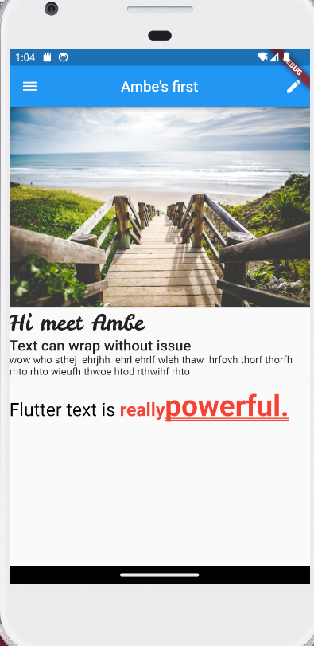

## Ambe's First.

## Table of contents

- [Description]  
- [Screenshot]
- [Built with]
- [What I learned]
- [Author]

## Description

- This is a one page app which shows a beach image has a navigator and some designed text.

## Screenshots

## Built with

- Flutter and Dart

## What I learned

- How to use Text and RichText, and also using a leckerliOne font family
- Basics of the drawer navigator
- How to display pictures, and use column and row widgets.

## Author

- Application - [Ambe Mbong-Nwi Nchang](https://github.com/Ambe-Mbong-Nwi/Flutter-Projects.git)

