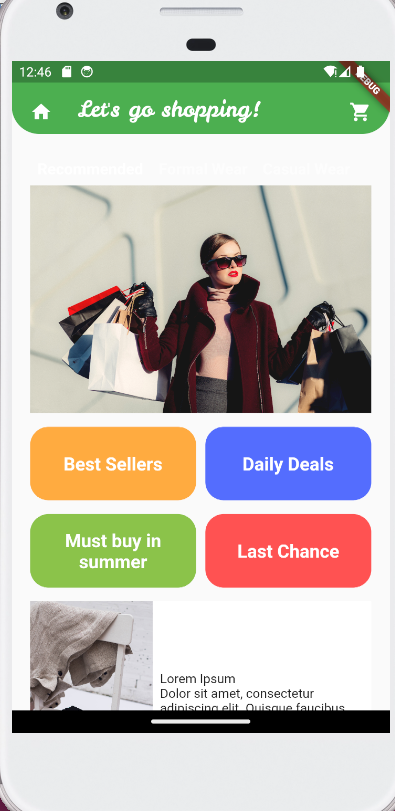
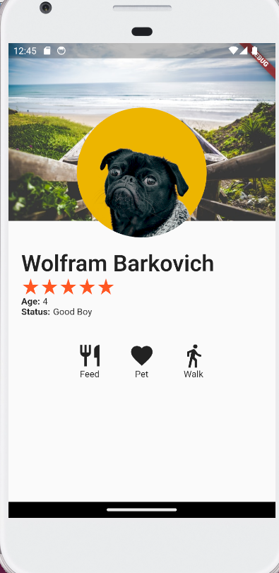
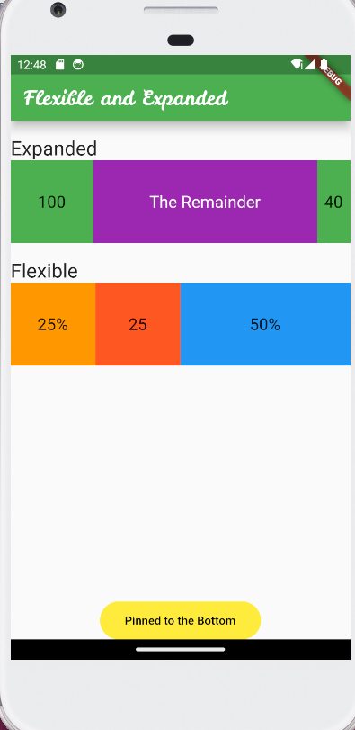

## Shopping and Profile Screens

## Table of contents

- [Description]  
- [Screenshot]
- [Built with]
- [What I learned]
- [Author]

## Description

- The first screen here displays a sample e-commerce app home page.
- The second screen is a dog's profile displaying his picture, name, age , rating.

## Screenshots

## Built with

- Flutter and Dart

## What I learned

- How to use expanded and flexible widgets.
- How to display pictures, and use column and row widgets.
- How to use and decorate the app bar

## Author

- Application - [Ambe Mbong-Nwi Nchang](https://github.com/Ambe-Mbong-Nwi/Flutter-Projects.git)

