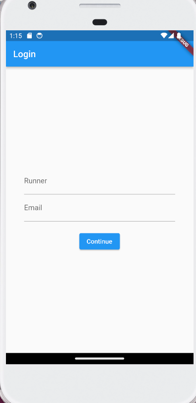

## Stop Watch

## Table of contents

- [Description]  
- [Screenshot]
- [Built with]
- [What I learned]
- [Author]

## Description

- The first screen here is the login screen where the runner logs in with the username and email
- The second screen displays the stop watch which displays the different laps and time in milliseconds the runner uses to complete her run.

## Screenshots

## Built with

- Flutter and Dart

## What I learned

- How to use stateful widgets.
- How to use textformfields and a button to navigate to the next page.
- How to display an alert dialogue.

## Author

- Application - [Ambe Mbong-Nwi Nchang](https://github.com/Ambe-Mbong-Nwi/Flutter-Projects.git)

