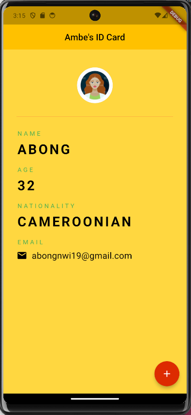

## Ambe's ID Card

## Table of contents

- [Description]  
- [Screenshot]
- [Built with]
- [What I learned]
- [Author]

## Description

- This is an ID card displaying sample information 
- The age increments each time the floatingAction Button is clicked

## Screenshots

## Built with

- Flutter and Dart

## What I learned

- Difference between StatelessWidget and StatefulWidgets
- How to use stateful widgets to change state

## Author

- Application GitHub Link- [Ambe Mbong-Nwi Nchang](https://github.com/Ambe-Mbong-Nwi/Flutter-Projects.git)

