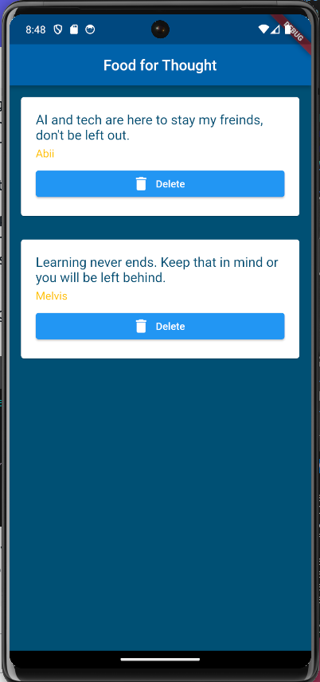

## List of Quotes

## Table of contents

- [Description]  
- [Screenshot]
- [Built with]
- [What I learned]
- [Author]

## Description

- This is a list of quotes displaying different information
- All list items have a delete button and icon which can be used to delete that list item from the list.

## Screenshots

## Built with

- Flutter and Dart

## What I learned

- Using map function to map through a list of data and output list items.
- How to delete data from a StatelessWidget by defining the function in the StatefulWidget and accessing it as a parameter in the StatelessWidget.
- Seperation of data and logic from UI by defining classes in a different file from that of the UI

## Author

- Application - [Ambe Mbong-Nwi Nchang](https://github.com/Ambe-Mbong-Nwi/Flutter-Projects.git)

